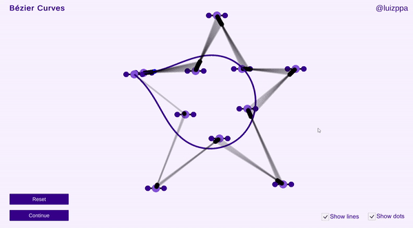

  

# Bezier Curve Visualization

A didactic and interactive bezier curve visualization made in Unity.

> A work in progress!

## What are bezier curves?

If you ever used programs like Adobe Illustrator or Corel Draw, you are probably used to some kind of pen tool. You probably used a pen to draw a line, and then you used the pen to draw a curve, then tweaked the handles to give the desired shape to that curve. But do you know how those handles work deep down?

That is what bezier curves are for. They are a way to draw complex curves with a lot of control points. Like this one:

  

This result is achieved by, simply put, moving dots along lines that connect other dots. The initial dots are the control points. Using linear interpolation, we create dots that is somewhere in between two of these control points, then do the same to create dots that are somewhere in between these "child dots" and do so until we have only one moving dot. If we trace the route of this last dot, we get a curve that can look like anything we want.

That is likely not a very clear explanation, which is why I tried making a step by step example of a bezier curve that you can interact with and hopefully get a better idea of how it works along the way.

## Usage

You can access the WebGL version [here](https://luizppa.github.io/bezier-curve-visualization/)!

Simply drag and drop the red dots to create a curve. You can add more points by clicking on the yellow dots arround the red ones (right to add after, left to add before). You can visualize the curve construction by clicking the "Continue" button on the bottom left. Click "Reset" to reset the curve.

  

## Further reading (or watching)

* Freya Holmér on bezier curves and linear interpolation [here](https://www.youtube.com/watch?v=NzjF1pdlK7Y), she also does game related content every now and then, be sure to check out her [YouTube channel](https://www.youtube.com/c/Acegikmo/videos)!
* [Monsieur Bézier and his elegant curves](https://uxdesign.cc/monsieur-b%C3%A9zier-and-his-elegant-curves-52769cca1490) by Eva Schicker.
* [The Bézier curve - How car design influenced CAD](https://www.bricsys.com/blog/the-bezier-curve-how-car-design-influenced-cad) by Rose Barfield.
